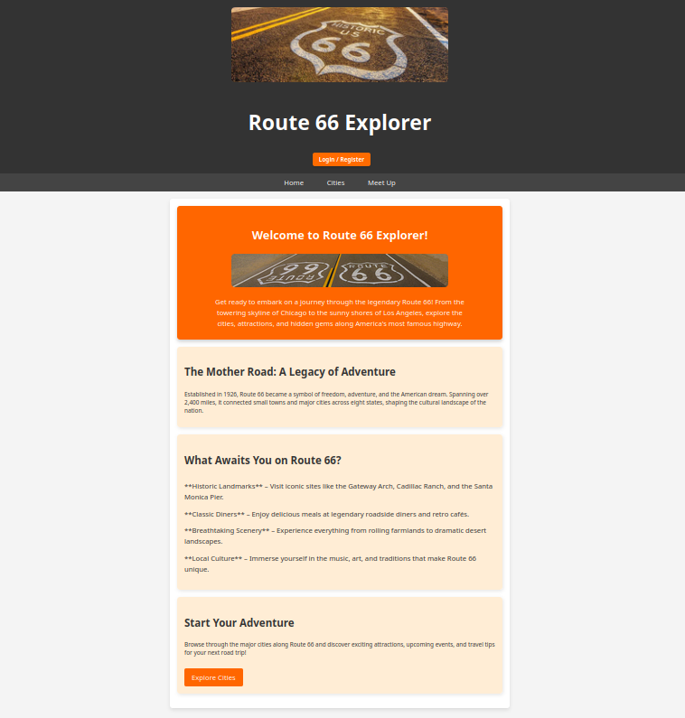
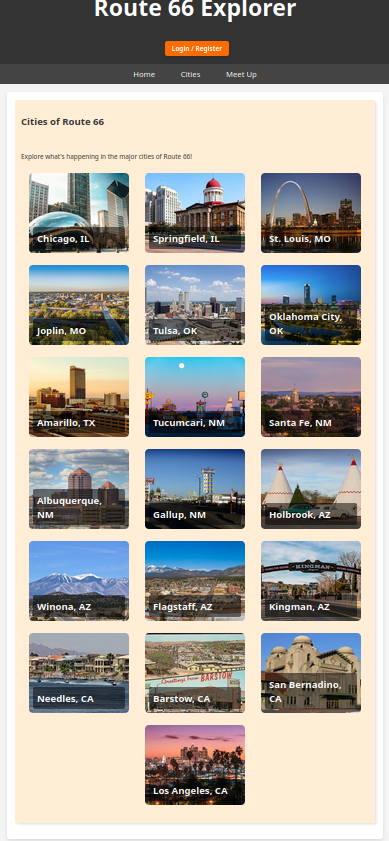
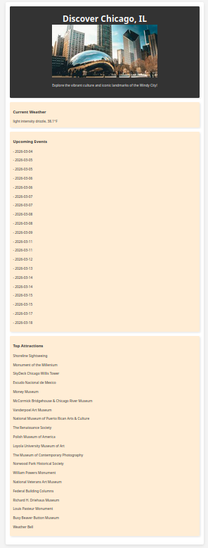
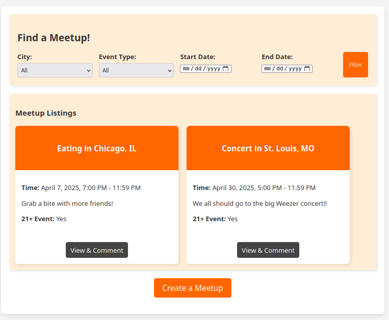
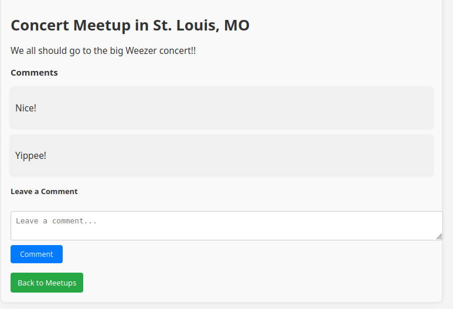

# Route 66 Explorer

🏆 **USITCC 2025 – Most Innovative Award**

Route 66 Explorer is a full-stack web application designed to help travelers explore the historic Route 66 while connecting with other travelers along the way.

The site aggregates live data about **weather, local events, and attractions** for major cities along Route 66. It also includes a **community meetup system** where users can create posts, organize meetups, and interact with other travelers.

---

## Features

- 🌤 **Live Weather Data** using external APIs
- 🎉 **Local Events Integration** for each city
- 📍 **City exploration pages** highlighting key stops along Route 66
- 👥 **Community meetup system**
- 📝 **User-generated posts and comments**
- ✏️ **Full CRUD functionality** (create, edit, delete posts and replies)
- 🔐 **User authentication system**

---

## Tech Stack

**Frontend**
- HTML
- CSS
- JavaScript

**Backend**
- PHP
- MySQL

**APIs**
- Weather API
- Local Events API

---

## Screenshots

### Homepage
The main landing page introduces the Route 66 experience and provides quick navigation to cities and meetup features.

---

### Cities Page
Users can explore major cities along Route 66 and view weather, events, and attractions.

Detailed city information including real-time data.

---

### Community Meetup Page
Travelers can create posts, organize meetups, and interact with other users.

Comment threads allow users to discuss and coordinate meetups.

---

## Project Background

This project was developed as a solo project and received the **Most Creative Award at the 2025 USITCC (U.S. Information Technology Collegiate Conference)**.

The goal was to combine **travel exploration with community interaction**, creating a platform where Route 66 travelers could both discover locations and connect with others along their journey.
